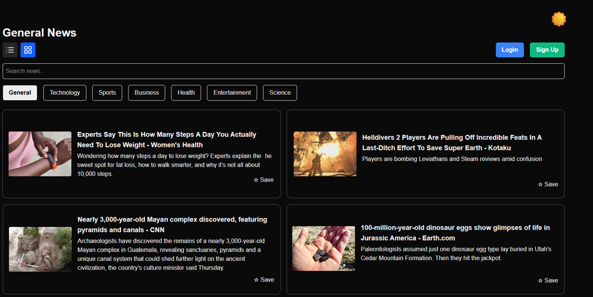
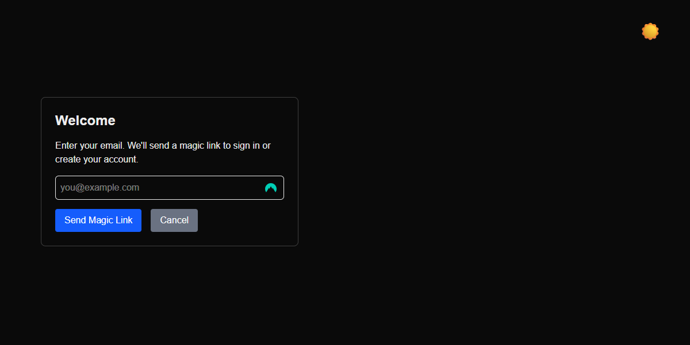

# News Briefs

A modern news aggregator web app built with **Next.js 15**, **Tailwind CSS**, and **NextAuth.js** for authentication. The app fetches top headlines from the [NewsAPI](https://newsapi.org) and allows users to sign in using email magic links.

## Features

- Email-based login via magic link (NextAuth)
- Browse top headlines by category (e.g., business, tech, sports)
- Save favorite articles (requires login)
- Fully responsive layout with dark mode
- Powered by Prisma + Postgres for persistence
- Deployed on [Vercel](https://vercel.com)

## Demo

Live site: [https://news-briefs.vercel.app/](https://news-briefs.vercel.app/)

## Screenshots




## Tech Stack

- **Frontend:** Next.js 15 (App Router), TypeScript, Tailwind CSS
- **Backend:** API Routes, NextAuth, Prisma ORM
- **Email:** Nodemailer + Mailtrap (for dev)
- **Database:** PostgreSQL
- **Deployment:** Vercel

## Setup Instructions

### 1. Clone the repository

```bash
git clone https://github.com/anthony-reese/news-aggregator.git
cd news-briefs
```

### 2. Install dependencies

```
npm install
```

### 3. Configure environment variables
Create a .env.local file based on .env.example:
```
DATABASE_URL="file:./dev.db"
NEWS_API_KEY="your_news_api_key"
EMAIL_SERVER_HOST="smtp.mailtrap.io"
EMAIL_SERVER_PORT=587
EMAIL_SERVER_USER="your_mailtrap_user"
EMAIL_SERVER_PASSWORD="your_mailtrap_pass"
EMAIL_FROM="news@app.com"
NEXTAUTH_SECRET="a_secure_random_string"
```

### 4. Run development server
```
npx prisma generate
npx prisma migrate dev --name init
npm run dev
```

### 5. Build for production
```
npm run build
npm start
```

## Contact
- For questions or feedback: [@anthony-reese](https://github.com/anthony-reese)

## License
- [MIT](https://mit-license.org) © 2025


